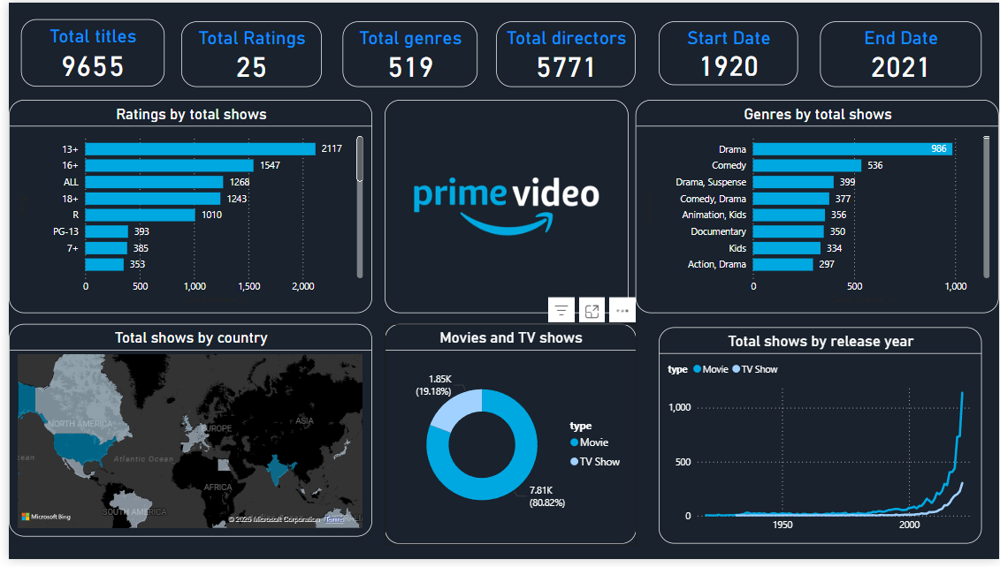

# 📺 Prime Video Genre Analysis Dashboard – Power BI Project

This Power BI dashboard provides insights into the viewership and popularity of different genres on Amazon Prime Video. It helps understand which genres are most watched, highest rated, and trend over time.

## 📌 Key Insights:
- Top genres by watch time
- Ratings vs Views analysis
- Viewer distribution across genres
- Slicers for dynamic filtering

## 🧰 Tools Used:
- Power BI
- DAX
- Data Modelling
- Visualization (bar chart, pie chart, line chart)

## 📄 Files Included:
- `prime video dashboard.pbix`: Power BI report file
- `prime video.pdf`: Certificate / project summary
- `screenshot.png`: Visual preview of the dashboard

## 📷 Dashboard Preview:
## 🖼️ Dashboard Preview:

